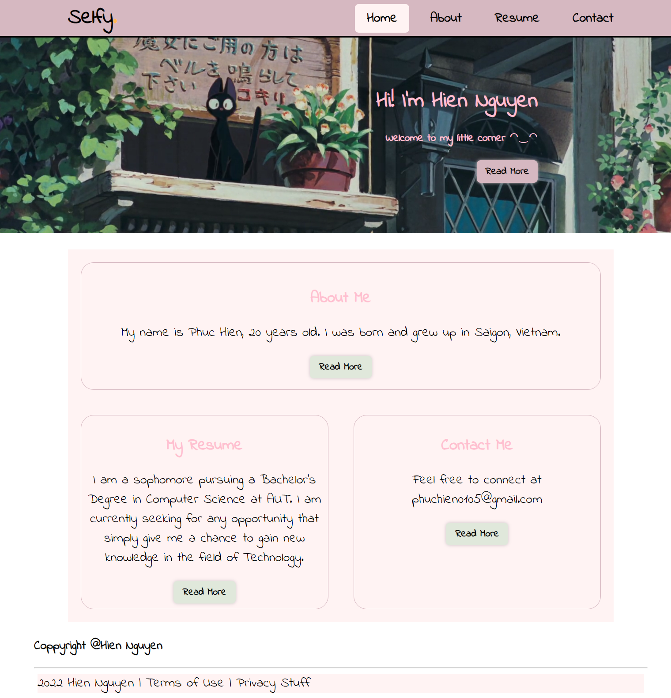
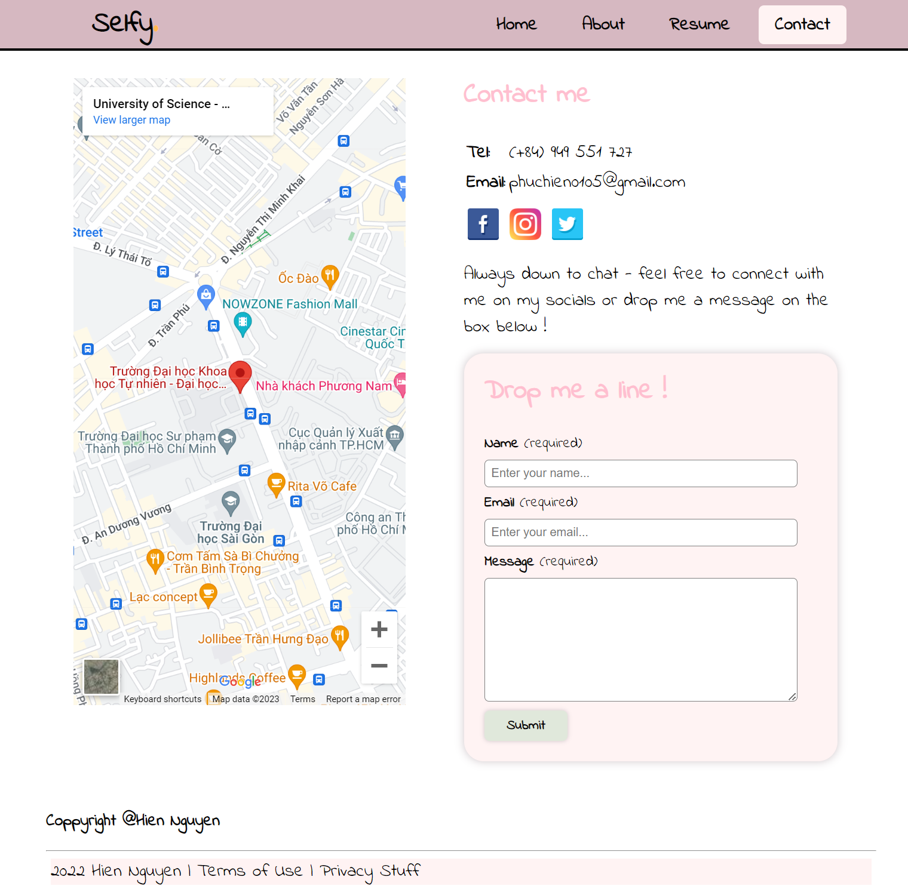

# Myselfy Website

## Overview

The "Myselfy" website is a personal HTML and CSS project designed to create a responsive website that provides visitors with information about myself. The website consists of four main pages: Home, About, Resume, and Contact. Each page serves a unique purpose to help visitors get to know me better.

## Pages

### 1. Home

The Home page serves as the landing page for the website. It provides a brief introduction and welcomes visitors to explore the content available on other pages.

### 2. About

The About page offers detailed information about myself. 

### 3. Resume

The Resume page serves as an online version of my resume. It includes information about my education, work experience, skills and other activities

### 4. Contact

The Contact page provides visitors with ways to get in touch with me. This may include a contact form, email address, or links to social media profiles.

